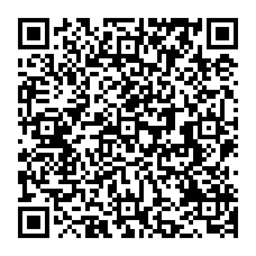

# yolgezer

Your monero node on the road.
Shell scripts to automate installing a monero node
on your android termux.

## Install

```
bash -c "$(curl -fsSL https://github.com/k4r4b3y/yolgezer/raw/main/src/yolgezer.sh)"
```
<center> 
<figure>

<figcaption>Scan to copy the oneliner to paste in your termux!</figcaption>
</figure>
</center>

## Tips (XMR):
```
8AuTSiz2vAH2RB8FVXoVLdKWtvnKALG7vEFV2LXwWgmk8dq97hKBwHsNsiWP7q7xGRBtistBxEondj7FqiYdxgqjURUPx2Z
```

<center> 
<figure>

</figure>
</center>

